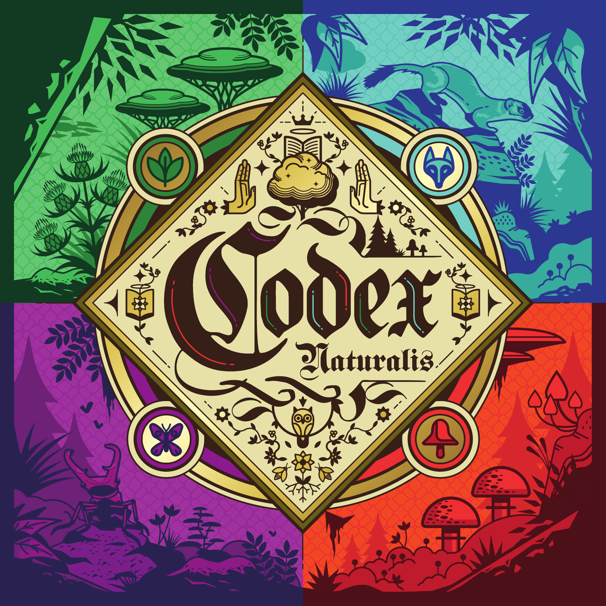
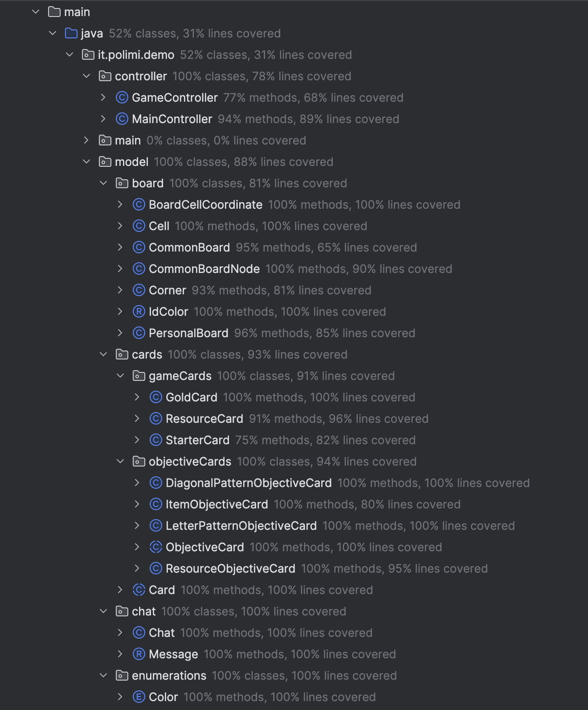
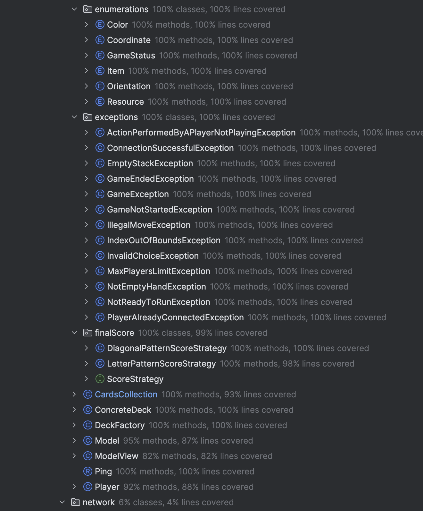

# Prova Finale - Ingegneria del Software - A.A. 2023/24


### Gruppo GC49
- [Valentina Pucci](https://github.com/ValentinaPucci)
- [Riccardo Ruggieri](https://github.com/RiccardoRuggieri)
- [Margherita Santarossa](https://github.com/margherita-santarossa)
- [Lorenzo Sciarretta](https://github.com/L-Neur0)

We have implemented the following features:
   | Feature | Implemented  |
|:--------|:----|
| Complete rules  | :heavy_check_mark:    |
| Socket  | :heavy_check_mark:    |
| RMI  | :heavy_check_mark:    |
| TUI | :heavy_check_mark:    |
| GUI  | :heavy_check_mark:    |
| Multiple Games   | :heavy_check_mark:    |
| Chat  | :heavy_check_mark:    |

Requirements: <a href="https://github.com/ValentinaPucci/ing-sw-2024-pucci-ruggieri-santarossa-sciarretta/blob/main/DOC/Requirements/requirements.pdf">requirements.pdf</a> <br>
Rulebook_ITA: <a href="https://github.com/ValentinaPucci/ing-sw-2024-pucci-ruggieri-santarossa-sciarretta/blob/main/DOC/Requirements/CODEX_Rulebook_IT.pdf">Rulebook_ITA</a> <br>
Rulebook_ENG: <a href="https://github.com/ValentinaPucci/ing-sw-2024-pucci-ruggieri-santarossa-sciarretta/blob/main/DOC/Requirements/CODEX_Rulebook_EN.pdf">Rulebook_EN</a> <br>
Official Site: <a href="https://www.craniocreations.it/prodotto/codex-naturalis">producer site</a>


# How to play:

First, the user is asked to enter the server's IP address, which can be found on the server's interface once it is running. The game can be played using either the command line interface (TUI) or the graphical interface (GUI): the user selects the interface upon launching the program, following the provided instructions.

The user then chooses the connection protocol they want to use by following the instructions in the terminal. They can opt to create a game, join a random game, or join a specific game by entering the game ID. The player creating a game can select the number of players, choosing a number between 2 and 4. Every user must choose a nickname to play. The nickname must be unique within the same game and not already used by another connected player. Once this is done, if there are enough players waiting and all are ready, the match begins. During the game, the player whose turn it is will be notified so they can take their turn by following the instructions. Each turn is divided into three phases: selecting a card to play from their hand, selecting a place on their personal board to place the card, and selecting a common card to draw.

Users can also write a message in the public chat or a private message to another player, at any moment:
Public message: they need to write "/c" and the message.
Private message: they need to write "/cs", the Nickname of the recipient player separated by a space, and the message.

If a player disconnects, the game ends immediately.

# How to Use 
Jar's are in the "out" directory. There are two jars, respectively of the Server and the Client.
First of all you need to save the "out" directory wherever you need. Then, open the terminal in that directory and type:

to start the Server:
```bash
java -jar artifacts/Server_jar/ing-sw-2024-pucci-ruggieri-santarossa-sciarretta.jar
```

to start the Client:
```bash
java -jar artifacts/Client_jar/ing-sw-2024-pucci-ruggieri-santarossa-sciarretta.jar
```

## Test Coverage



## UML Diagrams
- Class Diagrams
  - [Model+Controller](Deliverables/UML/Model+Controller.pdf)
  - [Model+Controller(high level)](Deliverables/UML/Model+Controller_AltoLivello.pdf)
  - [Autogenerated UML](Deliverables/UML/autogeneratedUML.png)
  - [RMI](Deliverables/UML/UML_RMI.pdf)
  - [SOCKET](Deliverables/UML/UML_socket.pdf)
- Sequence Diagrams
  - [RMI](Deliverables/sequenceDiagrams/RMI_Protocol.pdf)
  - [SOCKET](Deliverables/sequenceDiagrams/Socket_protocol.pdf)
 
  
## Disclaimer
NOTA: Codex Naturalis è un gioco da tavolo sviluppato ed edito da Cranio Creations Srl. I contenuti grafici di questo progetto riconducibili al prodotto editoriale da tavolo sono utilizzati previa approvazione di Cranio Creations Srl a solo scopo didattico. È vietata la distribuzione, la copia o la riproduzione dei contenuti e immagini in qualsiasi forma al di fuori del progetto, così come la redistribuzione e la pubblicazione dei contenuti e immagini a fini diversi da quello sopracitato. È inoltre vietato l'utilizzo commerciale di suddetti contenuti.
